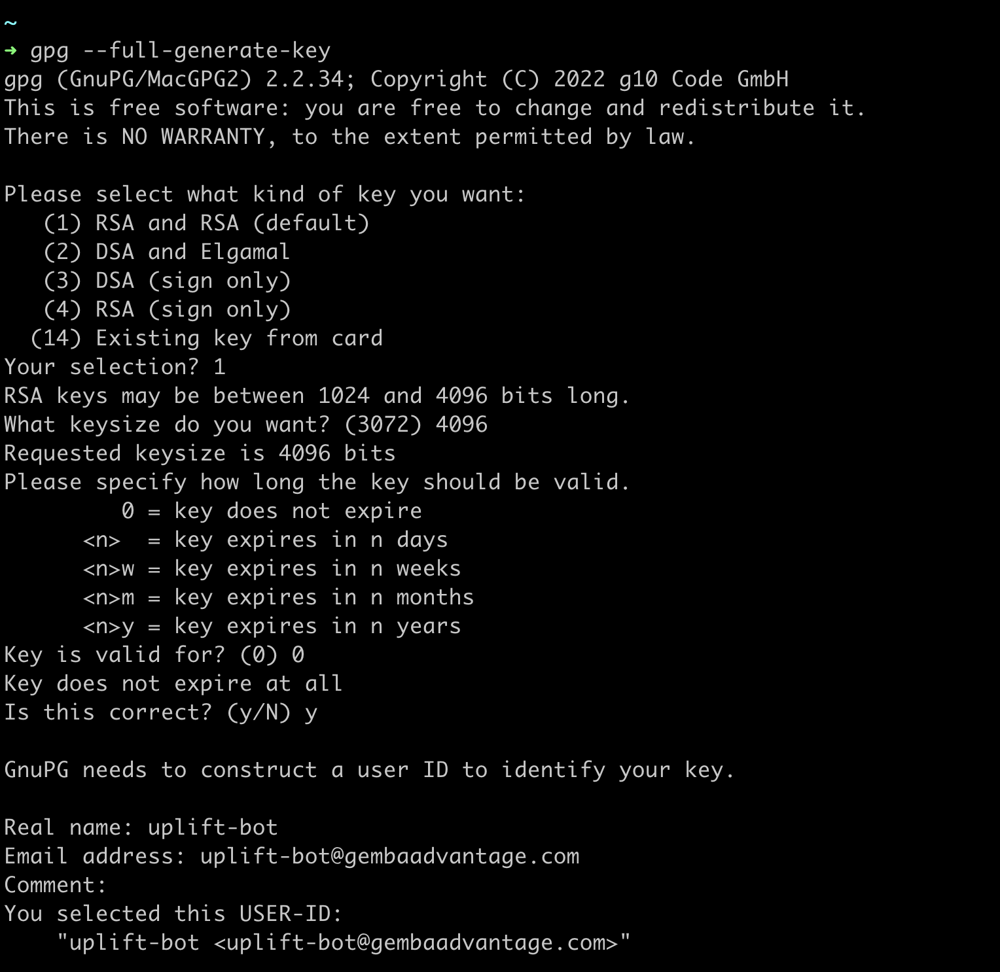
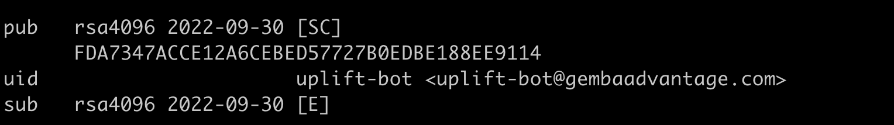

# Signing your Commits

:octicons-beaker-24: Experimental

It is best security practice to sign commits with a GPG key to prove their authenticity. Uplift detects the presence of a GPG key through environment variables and will automatically sign any commit.

- `UPLIFT_GPG_KEY`
- `UPLIFT_GPG_PASSPHRASE`
- `UPLIFT_GPG_FINGERPRINT`

## Generating a GPG Key

```sh
gpg --full-generate-key
```

Follow the on-screen prompts, selecting `RSA and RSA (default)` and specifying a key length of `4096`. Don't forget to use a **strong** passphrase.



Take note of the fingerprint, which is `FDA7347ACCE12A6CEBED57727B0EDBE188EE9114`, in this instance:



## Exporting a GPG Key

Please export your GPG key using the `ASCII Armor` format. Enter your passphrase when prompted.

```sh
gpg --armor --export-secret-key FDA7347ACCE12A6CEBED57727B0EDBE188EE9114
```

You can also `base64` encode the output:

```sh
gpg --armor --export-secret-key FDA7347ACCE12A6CEBED57727B0EDBE188EE9114 | base64
```

## Limitations

Signing-only sub-keys are not supported.
