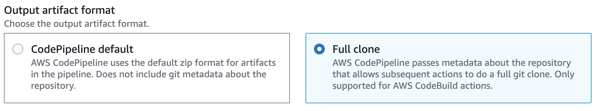

# AWS CodeBuild

AWS provides two developer services for building code through CI, `AWS CodePipeline` and `AWS CodeBuild`. The former being an orchestration tool, while the later executes each stage using a [buildspec](https://docs.aws.amazon.com/codebuild/latest/userguide/build-spec-ref.html) file. This guide assumes both were configured manually through the AWS Console and only focuses on the gotchas[^1].

## CodePipeline

By default CodePipeline clones a repository to S3 without the `.git` metadata folder. A [full clone](https://docs.aws.amazon.com/codepipeline/latest/userguide/tutorials-codecommit-gitclone.html)[^2] is needed for uplift to run.

{ align=left }

## CodeBuild

### IAM

Additional permissions are needed to pull and push code within AWS CodeBuild. These vary based on the SCM used.

!!!attention "Principle of Least Privilege"

    For illustration purposes, a resource type of `"*"` is used. This should always be narrowed to the specific resource when possible.

#### CodeCommit

Both the `codecommit:GitPull` and `codecommit:GitPush` IAM permissions are needed.

```{ .json .annotate linenums="1" hl_lines="8" }
{
  "Version": "2012-10-17",
  "Statement": [
    {
      "Sid": "CodeCommitUplift",
      "Effect": "Allow",
      "Action": ["codecommit:GitPull", "codecommit:GitPush"],
      "Resource": "*"
    }
  ]
}
```

#### GitHub

### Buildspec

Tested with the Amazon Linux and Ubuntu images provided by AWS:

```{ .yaml .annotate linenums="1" hl_lines="5" }
# buildspec.yml

version: 0.2
env:
  git-credential-helper: yes # (1)
phases:
  install:
    commands:
      - curl https://raw.githubusercontent.com/gembaadvantage/uplift/main/scripts/install | bash
  pre_build:
    commands:
      - git checkout $BRANCH_NAME
  build:
    commands:
      - uplift release
```

1. Without this uplift will lack any [credentials](https://docs.aws.amazon.com/codebuild/latest/userguide/build-spec-ref.html#build-spec.env.git-credential-helper) when attempting to push code back to the source SCM.

[^1]: A preferred approach for generating an AWS CodePipeline would be to either write a CloudFormation [template](https://docs.aws.amazon.com/AWSCloudFormation/latest/UserGuide/aws-resource-codepipeline-pipeline.html) manually or use the [AWS CDK](https://github.com/aws/aws-cdk) tooling. This is known as Infrastructure as Code (IaC), and wasn't included in the documentation to avoid unnecessary complexity.
[^2]: This strategy works for all [supported](https://docs.aws.amazon.com/codepipeline/latest/userguide/integrations-action-type.html#integrations-source) SCM providers.
